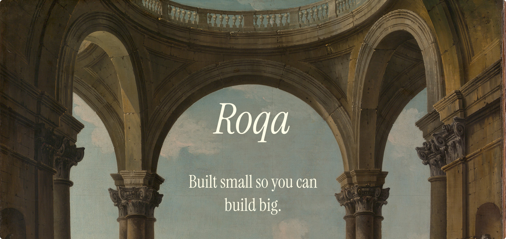

<a href="https://roqa.dev">
	
</a>
<div align="right">

*Banner design incorporates art from [The Met Open Access Collection](https://www.metmuseum.org/art/collection/search/436782)*

</div>

## What is Roqa?

Roqa is a compile-time reactive web framework for building user interfaces and applications.

A play on the word "baroque" –– a term to describe the ornate and elaborate style of art, architecture, and music from 17th and 18th century Europe –– Roqa is built to be extremely small and fast, so *you* have the space to build big.

## At a glance

```jsx
import { defineComponent, cell, get, set } from "roqa";

function App() {
	const count = cell(0);
	const doubled = cell(() => get(count) * 2);

	const increment = () => {
		set(count, get(count) + 1);
	};

	return (
		<>
			<button onclick={increment}>Count is {get(count)}</button>
			<p>Doubled: {get(doubled)}</p>
		</>
	);
}

defineComponent("counter-button", App);
```

## License

[MIT](./LICENSE)
